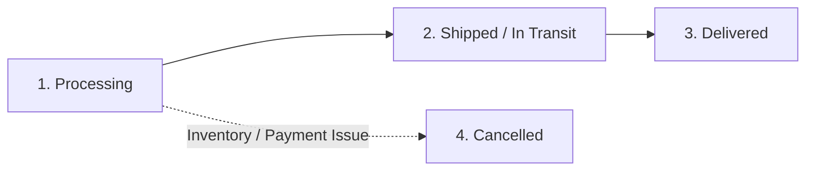

# Northstar Retail Co. Help Center Dashboard
## Self-Serve Content Set: Ticket Type 1 — Order Status

---

### Document Control & Metadata

| Attribute | Details |
| :--- | :--- |
| **Document Title** | Northstar Retail Co. Self-Serve Help Center Content Set |
| **Scope** | Ticket Type 1 — Order Status ("Where is my order?" / "Has this shipped yet?") |
| **Owner** | Customer Experience Content & Support Operations |
| **Target Audience** | Help Center CMS Team, Frontend Engineers, Customer Support Operations |
| **Status** | Production Ready / Approved for CMS Publishing |
| **Version** | v1.0.0 |
| **Last Updated** | August 13, 2026 |

---

## 1. Section Landing Intro Copy

### Order Status & Package Tracking

Welcome to the **Northstar Retail Co. Order Help Hub**. Here you can check the real-time progress of your delivery, learn what to expect at each stage of shipment, and quickly resolve delivery questions.

#### What You Will Need
Before looking up your order status, please have one of the following ready:
* Your **9-digit Order Number** (found in your order confirmation email, e.g., `100293847`), **OR**
* The **Email Address** you used at checkout.

---

[UI: Order Lookup Box: Enter your 9-digit order number or account email]  
[UI: Button: Track Order]

---

> [!TIP]
> **Quick Self-Service**: Entering your order information in the lookup box above will display your live carrier tracking link, warehouse status, and estimated delivery timeframe instantly without waiting for a support agent.

---

## 2. Frequently Asked Questions (FAQ)

### FAQ 1: Where is my order, and how do I track it?

**Answer:**  
You can track your order in real time at any time using our self-serve lookup tool.

#### How to Check Your Live Status
1. Locate your **9-digit Order Number** in the confirmation email sent right after purchase.
2. Enter your order number or checkout email address in the lookup box at the top of this page.
3. Click **[UI: Button: Track Order]** to view your order stage, carrier details, and live location updates.

[UI: Order Lookup Box: Enter your 9-digit order number or account email]  
[UI: Button: Track Order]

#### What You Will See
* **Processing**: Our warehouse team is picking, packing, and preparing your items for dispatch.
* **Shipped / In Transit**: Your package has been handed to the carrier (FedEx, UPS, or USPS). You will see a live tracking link with an estimated delivery date.
* **Delivered**: Your package has arrived at your shipping address.

If you cannot find your order confirmation email, check your spam or junk folder, or search your inbox for `"Northstar Retail Co."`.

*Still need assistance? Scroll down to the [Still Need Help?](#4-still-need-help-escalation-block) section to contact our support team.*

---

### FAQ 2: How long does processing take before my order ships?

**Answer:**  
Standard warehouse processing typically takes **1 to 2 business days** (Monday through Friday, excluding public holidays) before your package is dispatched to the carrier.

#### Standard Processing Timeline
* **Orders Placed Mon–Fri before 12:00 PM EST**: Processing usually completes within **24 hours**.
* **Orders Placed Mon–Fri after 12:00 PM EST**: Processing begins the following business day and completes within **24 to 48 hours**.
* **Orders Placed on Weekends or Holidays**: Processing begins on the next business day.

#### Peak Season & Sale Events
During major promotional sales or holiday peak periods, processing may take up to **3 business days**. 

Once your package leaves our warehouse, you will receive an automated email with your official carrier tracking number. You can also check if your order has completed processing by entering your details into our order lookup tool:

[UI: Order Lookup Box: Enter your 9-digit order number or account email]  
[UI: Button: Check Processing Status]

*If your order has been in "Processing" for more than 3 business days without a tracking update, please reach out via our [Still Need Help?](#4-still-need-help-escalation-block) block below.*

---

### FAQ 3: My order shows as "Shipped" — why hasn't the tracking updated?

**Answer:**  
It is completely normal for carrier tracking status to show little or no activity for **24 to 48 hours** after your shipping confirmation email is sent.

#### Why Tracking Updates Delay
1. **Shipping Label Created**: When our warehouse prints your shipping label, our system automatically marks your order as "Shipped" and emails your tracking number.
2. **Carrier Pick-up**: Carriers collect packages from our facility in bulk at the end of each business day.
3. **First Hub Scan**: Detailed tracking events only appear after the carrier scans your individual package at their central sorting hub.

#### What to Do
* Allow up to **48 hours** from receiving your shipping email for the carrier system to register the initial scan.
* If your package is traveling across regional hubs, tracking may not update for several days while the truck or aircraft is in transit between states.

To check your latest tracking status directly with the carrier:

[UI: Order Lookup Box: Enter your 9-digit order number or account email]  
[UI: Button: View Carrier Tracking]

*If your tracking link shows no activity for more than 4 business days after receiving your shipping confirmation, please contact us using the [Still Need Help?](#4-still-need-help-escalation-block) section below.*

---

### FAQ 4: My estimated delivery date has passed — what should I do?

**Answer:**  
If your estimated delivery date has passed and your package has not arrived, we apologize for the delay! Shipping carriers occasionally experience regional delays due to weather, high package volume, or transit rerouting.

#### Step 1: Check Live Carrier Tracking
Enter your order number below to retrieve your live carrier status and check for active delay notices (e.g., "Severe Weather Delay" or "Address Issue"):

[UI: Order Lookup Box: Enter your 9-digit order number or account email]  
[UI: Button: Track Order]

#### Step 2: Understand the Grace Period
* **Within 24 Hours of Estimated Date**: Carriers often update delivery windows late in the day or push deliveries to the following business day. Please allow **24 hours** past the initial estimated delivery date.
* **More than 24 Hours Overdue**: If your package is overdue by more than 24 hours past the carrier's estimated delivery date `{{estimated_delivery_date}}`, our team will gladly file an urgent carrier trace on your behalf.

[UI: Button: Submit Overdue Delivery Ticket]

*For immediate agent assistance, proceed to the [Still Need Help?](#4-still-need-help-escalation-block) section.*

---

### FAQ 5: My order says "Delivered," but I never received it — what do I do?

**Answer:**  
If carrier tracking indicates your package was delivered but you do not have it, please do not worry. We take missing deliveries very seriously and will investigate immediately.

#### Step 1: Perform a Quick Physical Verification
Carriers occasionally drop packages in discreet locations to prevent theft. Please check:
* **Alternative Drop Spots**: Front porch, side doors, back patio, garage area, or under bushes.
* **Shared Spaces**: Mailrooms, apartment lobbies, front desks, or parcel lockers.
* **Neighbors & Household Members**: Check if a family member, roommate, or neighbor accepted the delivery on your behalf.

#### Step 2: Check for Early Carrier Scans
Carriers (especially USPS and FedEx) sometimes scan packages as "Delivered" while the delivery truck is still en route, dropping the package off up to **24 hours later**.

#### Step 3: Open a Priority Missing Package Ticket
If you still cannot locate your package **24 hours after** the "Delivered" scan:

[UI: Button: Open Priority Missing Package Investigation]

Our support team will initiate an official carrier investigation and issue a replacement or refund once verified.

*Or submit your details in the [Still Need Help?](#4-still-need-help-escalation-block) section below.*

---

### FAQ 6: Why was my order cancelled?

**Answer:**  
Orders are rarely cancelled, but when it happens, it is usually triggered automatically by one of the following reasons:

#### Common Cancellation Reasons
1. **Unforeseen Stock Out**: Occasionally, an item sells out in our warehouse before inventory counts refresh online.
2. **Payment Verification Failure**: Your bank or card issuer declined the transaction due to a billing address mismatch or security flag.
3. **Unreachable Shipping Address**: The delivery address provided could not be verified by carrier databases.
4. **Duplicate Order Protection**: Multiple identical orders placed within minutes trigger automated fraud prevention safeguards.

#### Refund Timeline for Cancelled Orders
When an order is cancelled, **you are never charged**. Any pending authorization hold placed on your payment method (`{{payment_method}}`) is released immediately. Your financial institution will reflect the funds in your account within **3 to 5 business days**.

You can review the specific cancellation reason recorded for your order by looking it up here:

[UI: Order Lookup Box: Enter your 9-digit order number or account email]  
[UI: Button: View Cancellation Details]

*If you need further clarification regarding a cancelled order, reach out to us in the [Still Need Help?](#4-still-need-help-escalation-block) section below.*

---

### FAQ 7: I didn't cancel my order — what happened, and how can I restore it?

**Answer:**  
If you received a cancellation notification that you did not request, we apologize for the frustration! Automated system cancellations occur when inventory runs out unexpectedly or when a payment authorization fails address verification checks.

#### How to Resolve a Cancellation Dispute
1. **Check Cancellation Details**: Look up your order number below to review the automated cancellation reason code.
2. **Verify Billing & Address Info**: Ensure your credit card billing ZIP code matches your bank record exactly.
3. **Re-Order Online**: If the item is still in stock online at `https://www.northstarretail.com`, you may place a new order using updated payment information.

[UI: Order Lookup Box: Enter your 9-digit order number or account email]  
[UI: Button: Inspect Cancellation]

#### Requesting Agent Assistance to Restore Your Purchase
If an item was cancelled due to a system error or stockout during a promotional discount, our support team can assist you with restoring your promotional pricing on a replacement order.

[UI: Button: Contact Support to Restore Order]

*Proceed to the [Still Need Help?](#4-still-need-help-escalation-block) block below to submit your cancellation review request.*

---

### FAQ 8: I can't find my order — what should I check?

**Answer:**  
If you placed an order with Northstar Retail Co. but cannot find your order confirmation or status details, follow these troubleshooting steps:

#### Step 1: Check Email Accounts & Folders
* Search all your email accounts for keywords: `"Northstar Retail"` or `"Order Confirmation"`.
* Check your **Spam**, **Junk**, **Promotions**, or **Updates** folders.

#### Step 2: Check for Typos in Email Address
If you made a typo in your email during checkout (e.g., `gnail.com` instead of `gmail.com`), your confirmation email will bounce, but your order is still safely processing in our system.

#### Step 3: Check Payment Statement
Look at your credit card or bank statement for a charge from `NORTHSTAR RETAIL CO`. The 9-digit order number is often printed directly in the transaction line descriptor (e.g., `NORTHSTAR*100293847`).

#### Step 4: Use Account Email Search
Try entering your primary email address into our lookup box:

[UI: Order Lookup Box: Enter your account email address]  
[UI: Button: Search Orders]

*If you still cannot locate any record of your purchase, please contact our team via the [Still Need Help?](#4-still-need-help-escalation-block) section below with your full name and payment billing ZIP code.*

---

### FAQ 9: Can I change my shipping address or speed up shipping after ordering?

**Answer:**  
Whether you can modify your shipping address or shipping speed depends entirely on **which stage your order is currently in**.

#### Stage 1: Order is "Processing" (Allowed within 1 Hour)
If you placed your order less than **1 hour ago** and it is in "Processing" status, we can often update your delivery address or upgrade shipping speed.

[UI: Order Lookup Box: Enter your 9-digit order number or account email]  
[UI: Button: Request Order Modification]

#### Stage 2: Order is "Shipped / In Transit" (Restricted)
Once your order has been dispatched from our warehouse and assigned a carrier tracking number, **Northstar cannot change the shipping address or delivery speed**. 

* **Carrier Intercept**: You may use your carrier tracking number directly on the carrier's platform to request a address hold or delivery reroute:
  * **FedEx**: Log into [FedEx Delivery Manager](https://www.fedex.com/delivery) to request hold at location.
  * **UPS**: Log into [UPS My Choice](https://www.ups.com/mychoice) to redirect your package.
  * **USPS**: Use [USPS Package Intercept](https://www.usps.com/manage/package-intercept.htm).

#### Stage 3: Order is "Delivered" or "Cancelled" (Not Allowed)
Modifications cannot be made to delivered or cancelled orders.

*If you need urgent address modification for an order placed within the last hour, contact support immediately via the [Still Need Help?](#4-still-need-help-escalation-block) section below.*

---

## 3. Standalone Article: Understanding Your Order Status

### Complete Guide to the Northstar Order Lifecycle

Whether you just completed checkout or are waiting for your package to arrive, understanding your order status helps you know exactly where your items are and what to expect next. 

This guide breaks down each stage of the order lifecycle, explains typical timeframes, highlights warning signals, and details what actions you can take at every step.

---

### 1. The 4 Core Order Stages in Plain Language

Every purchase at Northstar Retail Co. moves through a predictable lifecycle:



#### Stage 1: Processing 🛠️
* **What it means**: Your order has been successfully placed, payment is authorized, and our warehouse team is picking, inspection-checking, and packing your items into shipping boxes.
* **Typical Timeframe**: **1 to 2 business days** (up to 3 business days during major sales).
* **What you can do**: Request address updates or cancellation (within 1 hour of placing order).

#### Stage 2: Shipped / In Transit 🚚
* **What it means**: Your package is packed, labeled, and handed over to our shipping carrier (FedEx, UPS, or USPS). It is actively traveling through transit networks to your delivery address.
* **Typical Timeframe**: **2 to 5 business days** for Standard Shipping; **1 to 2 business days** for Expedited Shipping.
* **What you can do**: Track your package live using carrier link; request carrier package hold via FedEx Delivery Manager or UPS My Choice.

#### Stage 3: Delivered 🎉
* **What it means**: The carrier has completed final delivery and left the package at your specified shipping address (front porch, mailroom, parcel locker, or front desk).
* **Typical Timeframe**: Final destination reached.
* **What you can do**: Inspect items; report missing packages within 24–48 hours; initiate returns within 30 days.

#### Stage 4: Cancelled ⛔
* **What it means**: The order was halted before shipment due to an inventory stockout, payment authorization decline, or customer cancellation request.
* **Typical Timeframe**: Payment authorization hold released within **3 to 5 business days**.
* **What you can do**: Review cancellation reason; re-order item online; contact support to restore promotional pricing.

---

### 2. What's Normal vs. What's a Signal Something Is Wrong

Use this quick reference matrix to determine whether your order timeline is on track or requires support intervention:

| Order Stage | What Is Normal (No Action Needed) | Warning Signal (Action Required) | Recommended Action |
| :--- | :--- | :--- | :--- |
| **Processing** | Status stays "Processing" for 24 to 48 hours on business days. | Status stays "Processing" for **more than 3 business days**. | Contact support via lookup box to check warehouse status. |
| **Shipped** | Tracking link shows no updates for the first **24 to 48 hours** after email. | Tracking shows **no movement for 4+ consecutive business days**. | Open overdue delivery inquiry ticket. |
| **In Transit** | Estimated delivery date is today or tomorrow; package scans at regional hubs. | Carrier status shows **"Delivery Exception"**, **"Address Unreachable"**, or **"Return to Sender"**. | Contact support immediately to correct delivery details. |
| **Delivered** | Package arrives at porch/mailroom within carrier delivery window. | Tracking says "Delivered", but package is missing after **24 physical check**. | Submit Priority Missing Package Investigation ticket. |
| **Cancelled** | Email notification sent with explicit cancellation reason code. | Order cancelled without notification or refund pending past **5 business days**. | Contact billing support with 9-digit order number. |

---

### 3. Customer Actions Allowed & Restricted by Stage

To ensure fast delivery, our warehouse system automates fulfillment quickly. Here is what you can and cannot modify depending on your order stage:

```
+-------------------------------------------------------------------------------+
|                        CUSTOMER ACTION PERMISSIONS MATRIX                     |
+------------------------------+------------+------------+-----------+----------+
| Action                       | Processing | Shipped    | Delivered | Cancelled|
+------------------------------+------------+------------+-----------+----------+
| Track Package Live           | YES        | YES        | YES       | N/A      |
| Update Shipping Address      | YES (<1hr) | NO*        | NO        | NO       |
| Change Shipping Speed        | YES (<1hr) | NO         | NO        | NO       |
| Cancel Order                 | YES (<1hr) | NO         | NO        | N/A      |
| Request Carrier Hold         | NO         | YES (via carrier)| NO | NO       |
| Report Missing Package       | NO         | NO         | YES       | NO       |
| Start Return Request         | NO         | NO         | YES (<30d)| NO       |
+------------------------------+------------+------------+-----------+----------+
  *Note: Address changes after shipment must be requested directly through carrier intercept tools.
```

---

## 4. Still Need Help? Escalation Block

### Can't Find What You're Looking For?

If your question wasn't answered above, or if your order requires manual investigation by our customer care team, we are here to help!

#### Before You Contact Support
To help us resolve your inquiry as quickly as possible, please have the following details ready:
1. Your **9-digit Order Number** (e.g., `100293847`) or account checkout email address.
2. A brief description of your issue (e.g., *"Package overdue by 3 days"* or *"Marked delivered but missing"*).
3. Any carrier tracking details or screenshots if applicable.

---

[UI: Button: Contact Support]

---

#### Expected Response Time
Our support team reviews inquiries in the order received.
* **Expected Agent Response Time**: `{{support_response_time}}` (Typically within 2 business hours during regular operation).
* **Support Operating Hours**: Monday – Friday, 8:00 AM – 8:00 PM EST | Saturday – Sunday, 9:00 AM – 5:00 PM EST.
* **Email Destination**: Ticket responses will be sent directly to your registered email `{{customer_email}}`.

---

## 5. Variable Reference Catalog

The following table documents every dynamic placeholder variable used across this help center document. Content management systems (CMS) and frontend frameworks must bind these placeholders to live backend data properties:

| Placeholder Variable | Data Type | Description & Purpose | Example Value | Backend Source / API Mapping |
| :--- | :--- | :--- | :--- | :--- |
| `{{estimated_delivery_date}}` | Date | Projected date of package arrival | `August 15, 2026` | `Fulfillment.estimated_delivery` |
| `{{payment_method}}` | String | Description of payment method used | `Visa ending in 4242` | `Order.payment_method` |
| `{{support_response_time}}` | String | Promised agent ticket response SLA | `within 2 business hours` | System SLA Config |
| `{{customer_email}}` | String | Customer checkout email address | `alex.smith@example.com` | User Auth Session / Order API |
| `{{order_id}}` | String | 9-digit unique order identifier | `100293847` | `Order.id` |
| `{{carrier_name}}` | String | Logistics carrier name | `FedEx` / `UPS` / `USPS` | `Fulfillment.carrier` |
| `{{return_window_days}}` | Integer | Standard return window policy period | `30` | Company Policy Constant |

---

## 6. Notes & Recommendations for Product & Engineering

During the drafting of this self-serve FAQ and Help Dashboard content set, several key UX and CMS implementation decisions surfaced for team review:

### 1. Inline Order Lookup Widget vs. External Page Redirection
* **Current Content Design**: Every major FAQ entry includes a prominent `[UI: Order Lookup Box]` callout directly within the article body.
* **Recommendation**: Implement an inline AJAX lookup component directly within the Help Center page. When a customer enters their order number, render their live status card **inline above the FAQ answer** so they do not have to leave the help page or open multiple browser tabs.

### 2. Deep-Linking Chatbot Escalation to Help Dashboard FAQs
* **Current Content Design**: Terminology, timeframes (1–2 business day processing, 30-day return window, 24-hour grace period), and status terms strictly match the chatbot script (`northstar_support_chatbot_script.md`).
* **Recommendation**: Enable cross-linking between the Chatbot and Help Dashboard. If a customer clicks *"Read Return Policy"* or *"Track Order Guide"* in the chatbot, deep-link them directly to the corresponding anchor headers (e.g., `#faq-4-my-estimated-delivery-date-has-passed-what-should-i-do`) on this page.

### 3. Dynamic SLA Timeframes During Peak Operations
* **Current Content Design**: `{{support_response_time}}` defaults to `"within 2 business hours"`.
* **Recommendation**: Ensure the CMS template dynamically reads `{{support_response_time}}` from backend configuration. During peak sales or holiday surges, automatically update this placeholder to `"within 24 hours"` to set realistic customer expectations and reduce duplicate ticket submissions.

---
*End of Self-Serve FAQ & Help Dashboard Deliverable — Northstar Retail Co.*
