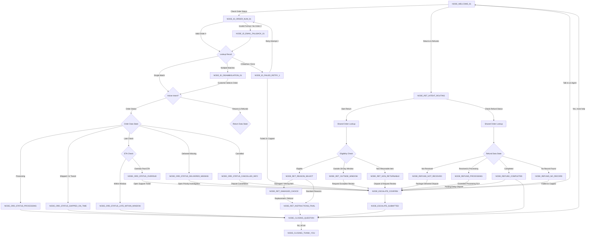

# Northstar Retail Co. Customer Support Chatbot
## Production Conversational Script & State Architecture

---

### Document Control & Metadata

| Attribute | Details |
| :--- | :--- |
| **Document Title** | Northstar Retail Co. Rules-Based Support Chatbot Script |
| **Owner** | Customer Experience Engineering & Support Operations |
| **Target Audience** | Frontend Engineers, Backend Integration Team, CX/Support Operations |
| **Scope** | Complete literal conversational script for **Order Status** and **Returns & Refunds** flows |
| **Status** | Production Ready / Approved for Implementation |
| **Version** | v1.0.0 |
| **Last Updated** | August 13, 2026 |

---

## 1. Flow Architecture Overview

This document specifies the exact, production-ready literal copy, decision logic, state transitions, input controls, dynamic data placeholders, and escalation tags for the Northstar Retail Co. support chatbot.

The bot operates as a deterministic, rules-based state machine containing **6 Primary Flows**:

1. **Flow 1: Welcome & Initial Intent Routing** (`NODE_WELCOME_*`)
2. **Flow 2: Shared Order Lookup & Customer Identification Engine** (`NODE_ID_*`)
3. **Flow 3: Order Status Branch** (`NODE_ORD_*`)
4. **Flow 4: Returns & Refunds Branch** (`NODE_RET_*` and `NODE_REFUND_*`)
5. **Flow 5: Shared Escalation Pipeline** (`NODE_ESCALATE_*`)
6. **Flow 6: Closing & Fallback Engine** (`NODE_CLOSING_*` and `NODE_FALLBACK_*`)

### State Machine Transition Diagram



---

## 2. Flow 1: Welcome & Initial Intent Routing

### `NODE_WELCOME_01`
* **Trigger**: Customer opens chat widget or starts a new session.
* **Input Expected**: Tappable quick-reply button selection.

```text
Hi there! Welcome to Northstar Retail Co. Support. 🤖

I'm your virtual assistant. I can quickly help you track orders, request returns, check refund statuses, or connect you with our customer support team.

How can I help you today?
```

* **Controls**:
  * `[Button: Check Order Status]` -> Route to `NODE_ID_ORDER_NUM_01` (Intent: Order Status)
  * `[Button: Returns & Refunds]` -> Route to `NODE_RET_INTENT_ROUTING`
  * `[Button: Talk to an Agent]` -> Route to `NODE_ESCALATE_CONFIRM` (Tag: `General / Customer Requested Agent`, Summary: `Customer requested direct transfer to human support agent.`)

---

## 3. Flow 2: Shared Order Lookup & Customer Identification Engine

### `NODE_ID_ORDER_NUM_01`
* **Trigger**: Customer selects "Check Order Status", "Start a Return", or "Check Refund Status" without active session authentication.
* **Input Expected**: Free text string (9-digit Order Number, e.g., `100293847` or `#100293847`).

```text
Let's find your order! 📦

Please enter your 9-digit Order Number (you can find this in your order confirmation email, e.g., 100293847).
```

* **Controls**:
  * `(free text expected)`
* **Validation & Transition Logic**:
  * If valid 9-digit format matched in DB (single match) -> Route to target intent node.
  * If valid 9-digit format matched in DB (multiple matches) -> Route to `NODE_ID_DISAMBIGUATION_01`.
  * If format invalid or not found in DB -> Route to `NODE_ID_EMAIL_FALLBACK_01`.

---

### `NODE_ID_EMAIL_FALLBACK_01`
* **Trigger**: Order number lookup returned 0 results or customer does not have their order number.
* **Input Expected**: Free text string (Email address, e.g., `alex@example.com`).

```text
I couldn't find an order matching that number. 

No worries! Please enter the email address you used when placing your order, and I'll look up your recent purchases.
```

* **Controls**:
  * `(free text expected)`
* **Validation & Transition Logic**:
  * If valid email format matched in DB (1 match) -> Route to target intent node.
  * If valid email format matched in DB (>1 match) -> Route to `NODE_ID_DISAMBIGUATION_01`.
  * If email not found in DB (Attempt #1 failure) -> Route to `NODE_ID_FAILED_RETRY_1`.

---

### `NODE_ID_DISAMBIGUATION_01`
* **Trigger**: System identifies multiple orders associated with the customer's email address or search query.
* **Input Expected**: Tappable order card button selection.

```text
I found multiple recent orders for {{customer_email}}. Please select the order you're inquiring about:
```

* **Controls**:
  * `[Button: Order #{{order_id_1}} — {{order_item_summary_1}} (Placed {{order_date_1}})]` -> Route to target intent node for `{{order_id_1}}`
  * `[Button: Order #{{order_id_2}} — {{order_item_summary_2}} (Placed {{order_date_2}})]` -> Route to target intent node for `{{order_id_2}}`
  * `[Button: None of these / Search again]` -> Reset counter & route to `NODE_ID_ORDER_NUM_01`

---

### `NODE_ID_FAILED_RETRY_1`
* **Trigger**: First lookup failure (Order # or Email returned 0 results).
* **Retry Counter**: 1 of 2.
* **Input Expected**: Free text string (Order number or Email address).

```text
We couldn't find any orders matching "{{user_input_query}}". 

Please double-check your order confirmation email for typos and try entering your 9-digit order number or account email address again.
```

* **Controls**:
  * `(free text expected)`
* **Validation & Transition Logic**:
  * If matched -> Route to target intent node or `NODE_ID_DISAMBIGUATION_01`.
  * If failed again -> Increment counter to 2 & route to `NODE_ID_FAILED_RETRY_2`.

---

### `NODE_ID_FAILED_RETRY_2`
* **Trigger**: Second consecutive lookup failure.
* **Retry Counter**: 2 of 2 (Final Retry Attempt).
* **Input Expected**: Free text string (Order number or Email address).

```text
We still couldn't locate an order with that information. 

Please make sure you are using the exact email address or order number associated with your Northstar Retail Co. purchase. Give it one more try:
```

* **Controls**:
  * `(free text expected)`
* **Validation & Transition Logic**:
  * If matched -> Route to target intent node.
  * If failed 3rd total attempt -> Route to `NODE_ID_FAILED_MAX`.

---

### `NODE_ID_FAILED_MAX`
* **Trigger**: Lookup failed 3 total times (Exceeded 2 retry limit).
* **Input Expected**: Auto-transition prompt (No input needed).

```text
I'm having trouble finding your order details in our system, but I don't want you to get stuck! 

Let's connect you with a customer support representative who can look up your account manually.
```

* **Controls**:
  * Auto-route to `NODE_ESCALATE_CONFIRM` with pre-filled metadata:
    * `{{escalation_tag}}` = `Order / Identification Failure`
    * `{{ticket_summary}}` = `Customer attempted order lookup 3 times without match. Search queries: "{{user_input_query}}".`

---

## 4. Flow 3: Order Status Branch

### Branch 3A: Order Not Yet Shipped (Processing)

#### `NODE_ORD_STATUS_PROCESSING`
* **Trigger**: Order identified; DB status = `PROCESSING` / `PREPARING_SHIPMENT`.
* **Input Expected**: Tappable action button.

```text
Here is the current status for order #{{order_id}}:

Status: 🛠️ Processing at Warehouse
Items: {{order_items_summary}}
Order Date: {{order_date}}
Estimated Ship Date: {{estimated_ship_date}}

Our warehouse team is carefully packing your items. You will receive an email with your tracking link as soon as your package leaves our facility!
```

* **Controls**:
  * `[Button: Back to Main Menu]` -> Route to `NODE_CLOSING_QUESTION`
  * `[Button: Cancel Order]` -> Route to `NODE_ORD_CANCEL_REQUEST`
  * `[Button: Talk to an Agent]` -> Route to `NODE_ESCALATE_CONFIRM` (Tag: `Order / Processing Inquiry`, Summary: `Customer requested human agent for processing order #{{order_id}}.`)

---

### Branch 3B: Order Shipped / In Transit

#### `NODE_ORD_STATUS_SHIPPED_ON_TIME`
* **Trigger**: Order identified; DB status = `SHIPPED` / `IN_TRANSIT`; carrier ETA is current or future date.
* **Input Expected**: Tappable action button.

```text
Great news! Order #{{order_id}} is on its way to you. 🚚

Carrier: {{carrier_name}}
Tracking Number: {{tracking_number}}
Estimated Delivery Date: {{estimated_delivery_date}} by {{estimated_delivery_time}}
Latest Update: {{latest_tracking_scan}} ({{latest_scan_location}})
```

* **Controls**:
  * `[Button: Track Package on {{carrier_name}}]` -> External link: `{{tracking_url}}`
  * `[Button: My delivery is late]` -> Route to `NODE_ORD_STATUS_LATE_CHECK`
  * `[Button: Back to Main Menu]` -> Route to `NODE_CLOSING_QUESTION`
  * `[Button: Talk to an Agent]` -> Route to `NODE_ESCALATE_CONFIRM` (Tag: `Order / Tracking Assistance`, Summary: `Tracking inquiry for shipped order #{{order_id}}.`)

---

### Branch 3C: Delivery Delayed / Overdue Split Logic

#### `NODE_ORD_STATUS_LATE_CHECK`
* **Internal Logic Evaluation**: Bot compares current system date against `{{estimated_delivery_date}}`.
  * If Current Date <= `{{estimated_delivery_date}}` -> Route to `NODE_ORD_STATUS_LATE_WITHIN_WINDOW`.
  * If Current Date > `{{estimated_delivery_date}}` -> Route to `NODE_ORD_STATUS_OVERDUE`.

---

#### `NODE_ORD_STATUS_LATE_WITHIN_WINDOW`
* **Trigger**: Customer clicks "My delivery is late", BUT current date is STILL within the carrier ETA window.
* **Input Expected**: Tappable action button.

```text
I checked your tracking details for order #{{order_id}}. ℹ️

Your package is currently in active transit with {{carrier_name}} and is still within its expected delivery window. 

Estimated Delivery: {{estimated_delivery_date}} by {{estimated_delivery_time}}
Latest Carrier Scan: "{{latest_tracking_scan}}" at {{latest_scan_location}} ({{latest_scan_date}})

Carriers sometimes update tracking status late in the day. If your package does not arrive by the end of {{estimated_delivery_date}}, please check back with us for immediate assistance!
```

* **Controls**:
  * `[Button: Track Package on {{carrier_name}}]` -> External link: `{{tracking_url}}`
  * `[Button: I still need help from an agent]` -> Route to `NODE_ESCALATE_CONFIRM` (Tag: `Order / Delayed Within ETA Window`, Summary: `Customer requested agent regarding transit time for order #{{order_id}} prior to ETA expiry.`)
  * `[Button: Back to Main Menu]` -> Route to `NODE_CLOSING_QUESTION`

---

#### `NODE_ORD_STATUS_OVERDUE`
* **Trigger**: Customer clicks "My delivery is late", AND current date HAS PASSED `{{estimated_delivery_date}}`.
* **Input Expected**: Tappable action button.

```text
I apologize for the delay! ⚠️

Order #{{order_id}} was estimated to arrive by {{estimated_delivery_date}}, but it appears to be running behind schedule with {{carrier_name}}.

Latest Scan: "{{latest_tracking_scan}}" ({{latest_scan_location}} on {{latest_scan_date}})

Because your package is past its estimated delivery date, I can submit an urgent carrier trace ticket with our support team to investigate the delay immediately.
```

* **Controls**:
  * `[Button: Open Support Ticket]` -> Route to `NODE_ESCALATE_CONFIRM` (Tag: `Order / Delayed Past ETA`, Summary: `Order #{{order_id}} overdue past estimated delivery date {{estimated_delivery_date}}. Carrier: {{carrier_name}}, Tracking: {{tracking_number}}.`)
  * `[Button: Track Package on {{carrier_name}}]` -> External link: `{{tracking_url}}`
  * `[Button: Back to Main Menu]` -> Route to `NODE_CLOSING_QUESTION`

---

### Branch 3D: Marked Delivered but Not Received (High Priority)

#### `NODE_ORD_STATUS_DELIVERED_MISSING`
* **Trigger**: Order identified; DB status = `DELIVERED`, but customer indicates they have not received it.
* **Input Expected**: Tappable action button.

```text
Carrier tracking indicates that order #{{order_id}} was delivered on {{delivery_date}} at {{delivery_time}}.

Delivered To: {{delivery_location_description}} (e.g., Front Porch / Mailroom)

Before we start an investigation, please quickly check around your porch, side doors, garage, or with household members/building management. Carriers occasionally mark packages delivered up to 24 hours before drop-off.

If you still cannot locate your package, let us know and we will open a priority missing-package investigation right away.
```

* **Controls**:
  * `[Button: Open Priority Investigation]` -> Route to `NODE_ESCALATE_CONFIRM` (Tag: `Order / Marked Delivered Not Received`, Summary: `Order #{{order_id}} marked delivered on {{delivery_date}} at {{delivery_location_description}}, but customer reports item missing. High priority.`)
  * `[Button: I found my package!]` -> Route to `NODE_CLOSING_QUESTION`
  * `[Button: Back to Main Menu]` -> Route to `NODE_CLOSING_QUESTION`

---

### Branch 3E: Order Cancelled

#### `NODE_ORD_STATUS_CANCELLED_INFO`
* **Trigger**: Order identified; DB status = `CANCELLED`.
* **Input Expected**: Tappable action button.

```text
Order #{{order_id}} was cancelled on {{cancellation_date}}.

Reason for Cancellation: {{cancellation_reason}}
Payment Refund Status: {{cancellation_refund_status}} ({{refund_amount}} returned to {{payment_method}} on {{refund_date}})

If a pending authorization hold was placed, funds are typically released by your bank within 3 to 5 business days.
```

* **Controls**:
  * `[Button: I didn't request this cancellation]` -> Route to `NODE_ORD_STATUS_CANCELLED_DISPUTE`
  * `[Button: Place a new order]` -> External link: `https://www.northstarretail.com`
  * `[Button: Back to Main Menu]` -> Route to `NODE_CLOSING_QUESTION`

---

#### `NODE_ORD_STATUS_CANCELLED_DISPUTE`
* **Trigger**: Customer selects "I didn't request this cancellation".
* **Input Expected**: Auto-transition prompt.

```text
I understand you did not request this cancellation. I apologize for any confusion or disruption this has caused!

Let's connect you with our support team to investigate why your order was cancelled and assist you with restoring your purchase.
```

* **Controls**:
  * Auto-route to `NODE_ESCALATE_CONFIRM` with metadata:
    * `{{escalation_tag}}` = `Order / Cancellation Dispute`
    * `{{ticket_summary}}` = `Customer disputes cancellation of order #{{order_id}}. Cancellation reason recorded: {{cancellation_reason}}.`

---

## 5. Flow 4: Returns & Refunds Branch

### `NODE_RET_INTENT_ROUTING`
* **Trigger**: Customer selects "Returns & Refunds" from main menu.
* **Input Expected**: Tappable quick-reply option.

```text
Welcome to Returns & Refunds! 🔄

Northstar Retail Co. offers hassle-free returns within 30 days of delivery for most items in original condition.

How can I assist you with your return today?
```

* **Controls**:
  * `[Button: Start a New Return]` -> Route to `NODE_ID_ORDER_NUM_01` (Intent: New Return)
  * `[Button: Check Refund Status]` -> Route to `NODE_ID_ORDER_NUM_01` (Intent: Refund Status)
  * `[Button: Read Return Policy]` -> External link / Display: `https://www.northstarretail.com/returns-policy`
  * `[Button: Back to Main Menu]` -> Route to `NODE_WELCOME_01`

---

### Sub-Flow 4A: Starting a New Return

#### `NODE_RET_REASON_SELECT`
* **Trigger**: Order identified; DB system verifies order is within 30-day window and contains returnable items.
* **Input Expected**: Tappable item/reason button selection.

```text
Order #{{order_id}} is eligible for return! 

Please select the main reason for your return:
```

* **Controls**:
  * `[Button: Wrong Size or Fit]` -> Route to `NODE_RET_INSTRUCTIONS_FINAL` (Reason: Wrong Size)
  * `[Button: Changed My Mind]` -> Route to `NODE_RET_INSTRUCTIONS_FINAL` (Reason: Changed Mind)
  * `[Button: Damaged or Defective Item]` -> Route to `NODE_RET_DAMAGED_CHOICE` (Reason: Damaged/Defective)
  * `[Button: Received Wrong Item]` -> Route to `NODE_RET_DAMAGED_CHOICE` (Reason: Wrong Item)
  * `[Button: Item Not as Described]` -> Route to `NODE_RET_INSTRUCTIONS_FINAL` (Reason: Not as Described)

---

#### `NODE_RET_DAMAGED_CHOICE`
* **Trigger**: Customer selects "Damaged or Defective Item" or "Received Wrong Item".
* **Input Expected**: Tappable choice option button.

```text
We are so sorry that your {{item_name}} arrived damaged or incorrect! We want to fix this for you right away at zero cost to you.

How would you like us to handle this?
```

* **Controls**:
  * `[Button: Send Free Replacement]` -> Route to `NODE_RET_REPLACEMENT_CONFIRM`
  * `[Button: Return for Full Refund]` -> Route to `NODE_RET_INSTRUCTIONS_FINAL` (Waive all return fees)
  * `[Button: Talk to an Agent]` -> Route to `NODE_ESCALATE_CONFIRM` (Tag: `Return / Damaged Item Support`, Summary: `Customer received damaged/wrong item {{item_name}} on order #{{order_id}}. Requested human support.`)

---

#### `NODE_RET_REPLACEMENT_CONFIRM`
* **Trigger**: Customer chooses "Send Free Replacement".
* **Input Expected**: Tappable action button.

```text
Your free replacement order has been submitted! 📦

Replacement Order ID: #{{replacement_order_id}}
Estimated Delivery: {{estimated_delivery_date}}

We've emailed a prepaid return shipping label to {{customer_email}} so you can send the original item back within 14 days. You will not be charged any shipping fees.
```

* **Controls**:
  * `[Button: Download Prepaid Return Label]` -> Link: `{{return_label_url}}`
  * `[Button: Back to Main Menu]` -> Route to `NODE_CLOSING_QUESTION`

---

#### `NODE_RET_INSTRUCTIONS_FINAL`
* **Trigger**: Return reason recorded; return label generated.
* **Input Expected**: Tappable action button.

```text
Your return request for order #{{order_id}} has been approved! 🎉

Here are your return instructions:

1. Download & Print Label: Click below to download your prepaid shipping label.
2. Package Items: Place the item(s) in original packaging with all tags attached.
3. Drop Off Package: Drop off your package at any {{carrier_name}} location by {{return_deadline_date}} ({{carrier_dropoff_info}}).

Refund Timing: Once dropped off, your refund of {{expected_refund_amount}} will be issued to your {{payment_method}} within 2 business days of warehouse arrival.
```

* **Controls**:
  * `[Button: Download Prepaid Return Label]` -> Link: `{{return_label_url}}`
  * `[Button: Email Return Label to Me]` -> Display confirmation: `"Return label emailed to {{customer_email}}!"` -> Route to `NODE_CLOSING_QUESTION`
  * `[Button: Back to Main Menu]` -> Route to `NODE_CLOSING_QUESTION`

---

#### `NODE_RET_OUTSIDE_WINDOW`
* **Trigger**: Order identified; DB system verifies order delivery date was > 30 days ago.
* **Input Expected**: Tappable action button.

```text
Order #{{order_id}} was delivered on {{delivery_date}} ({{days_since_delivery}} days ago). 

Our standard policy allows returns within 30 days of delivery. Because this order is outside the 30-day window, automated returns cannot be processed online.

If you have an extenuating circumstance, our support management team can review an exception request for store credit.
```

* **Controls**:
  * `[Button: Request Exception Review]` -> Route to `NODE_ESCALATE_CONFIRM` (Tag: `Return / Exception Request Outside Window`, Summary: `Order #{{order_id}} delivered {{delivery_date}} ({{days_since_delivery}} days ago). Customer requested return window exception review.`)
  * `[Button: Read Return Policy]` -> External link: `https://www.northstarretail.com/returns-policy`
  * `[Button: Back to Main Menu]` -> Route to `NODE_CLOSING_QUESTION`

---

#### `NODE_RET_NON_RETURNABLE`
* **Trigger**: Order identified; DB flag indicates selected item is non-returnable (e.g., Final Sale, Hygiene/Cosmetic, Customized).
* **Input Expected**: Tappable action button.

```text
The item "{{item_name}}" in order #{{order_id}} is marked as non-returnable. 

Reason: {{non_returnable_reason}} (e.g., Final Sale clearance item / Opened personal care product / Customized item).

If this item arrived damaged, defective, or incorrect, our support team can review your case for an exception.
```

* **Controls**:
  * `[Button: Dispute & Request Review]` -> Route to `NODE_ESCALATE_CONFIRM` (Tag: `Return / Non-Returnable Item Dispute`, Summary: `Customer disputes non-returnable restriction for item {{item_name}} on order #{{order_id}}. Reason flag: {{non_returnable_reason}}.`)
  * `[Button: Back to Main Menu]` -> Route to `NODE_CLOSING_QUESTION`

---

### Sub-Flow 4B: Checking Refund Status

#### `NODE_REFUND_NOT_RECEIVED`
* **Trigger**: Customer checks refund status; DB status = `RETURN_LABEL_CREATED` or `RETURN_IN_TRANSIT`; item not yet scanned at warehouse.
* **Input Expected**: Tappable action button.

```text
We are tracking your return for order #{{order_id}} (RMA #{{rma_number}}).

Return Package Status: 🚚 In Transit via {{carrier_name}}
Tracking Number: {{return_tracking_number}}
Estimated Warehouse Arrival: {{estimated_warehouse_arrival_date}}

Once our warehouse receives and inspects your package (1-2 business days), your refund of {{expected_refund_amount}} will be issued immediately.
```

* **Controls**:
  * `[Button: Track Return Package]` -> Link: `{{return_tracking_url}}`
  * `[Button: Package shows delivered to warehouse]` -> Route to `NODE_ESCALATE_CONFIRM` (Tag: `Refund / Not Received SLA Exceeded`, Summary: `Customer reports return tracking {{return_tracking_number}} shows delivered to warehouse, but RMA #{{rma_number}} is not marked received.`)
  * `[Button: Back to Main Menu]` -> Route to `NODE_CLOSING_QUESTION`

---

#### `NODE_REFUND_PROCESSING`
* **Trigger**: Customer checks refund status; DB status = `RETURN_RECEIVED_AT_WAREHOUSE` / `QUALITY_INSPECTION`.
* **Input Expected**: Tappable action button.

```text
Your return for order #{{order_id}} (RMA #{{rma_number}}) was received at our warehouse on {{warehouse_receive_date}} at {{warehouse_receive_time}}. 📦

Status: 🔍 Quality Inspection & Processing
Expected Refund Amount: {{expected_refund_amount}}
Processing SLA: Within 48 hours of receipt

Our team is completing inspection. You will receive an automated refund confirmation email as soon as processing finishes!
```

* **Controls**:
  * `[Button: I've waited longer than 48 hours]` -> Route to `NODE_ESCALATE_CONFIRM` (Tag: `Refund / Processing SLA Exceeded`, Summary: `RMA #{{rma_number}} received at warehouse on {{warehouse_receive_date}}, but refund has exceeded 48-hour processing SLA.`)
  * `[Button: Back to Main Menu]` -> Route to `NODE_CLOSING_QUESTION`

---

#### `NODE_REFUND_COMPLETED`
* **Trigger**: Customer checks refund status; DB status = `REFUND_ISSUED`.
* **Input Expected**: Tappable action button.

```text
Good news! Your refund for order #{{order_id}} (RMA #{{rma_number}}) has been processed. 💳

Refund Amount: {{refund_amount}}
Issued Date: {{refund_date}}
Payment Destination: {{refund_method}} (ending in {{payment_card_last4}})
Reference ID: {{transaction_reference_id}}

Please Note: Standard banking posting times take 3 to 5 business days for funds to appear on your bank statement.
```

* **Controls**:
  * `[Button: I don't see funds after 5 days]` -> Route to `NODE_ESCALATE_CONFIRM` (Tag: `Refund / Posting Delay Dispute`, Summary: `Refund of {{refund_amount}} processed on {{refund_date}} (Ref #{{transaction_reference_id}}), but customer reports funds missing after 5+ days.`)
  * `[Button: Back to Main Menu]` -> Route to `NODE_CLOSING_QUESTION`

---

#### `NODE_REFUND_NO_RECORD`
* **Trigger**: Customer checks refund status, but no active RMA or return request exists in DB for order #.
* **Input Expected**: Free text input or button selection.

```text
We couldn't find an active return or refund record for order #{{order_id}}.

If you recently mailed a package back to us using your own carrier, please enter your return tracking number below so we can trace it:
```

* **Controls**:
  * `(free text expected)`
  * `[Button: Start a New Return]` -> Route to `NODE_RET_REASON_SELECT`
  * `[Button: Talk to an Agent]` -> Route to `NODE_ESCALATE_CONFIRM` (Tag: `Return / Identification Failure`, Summary: `No return record found for order #{{order_id}}. Customer requested agent help.`)

---

## 6. Flow 5: Shared Escalation Pipeline

All handoffs to human customer support follow this **standardized 2-node pattern** across the entire bot application.

### `NODE_ESCALATE_CONFIRM`
* **Trigger**: Any flow branch requiring human support handoff or customer selecting "Talk to an Agent".
* **Input Expected**: Free text notes (optional) or button click.

```text
I'm opening a priority support ticket for our customer care team right now. 📋

Ticket Summary:
• Issue Category: {{escalation_tag}}
• Order Reference: #{{order_id}}
• Summary: {{ticket_summary}}

Would you like to add any extra details or photos for our team before I submit your ticket?
```

* **Controls**:
  * `(free text expected)` -> Appends input to ticket notes & routes to `NODE_ESCALATE_SUBMITTED`
  * `[Button: Skip & Submit Ticket Now]` -> Routes to `NODE_ESCALATE_SUBMITTED`

---

### `NODE_ESCALATE_SUBMITTED`
* **Trigger**: Support ticket successfully generated in ticketing backend (Zendesk / Gorgias / Freshdesk).
* **Input Expected**: Auto-transition to closing question.

```text
Your support ticket has been created! ✅

Ticket ID: #{{ticket_id}}
Category: {{escalation_tag}}
Expected Response Time: {{sla_response_time}} (Typically within 2 business hours)
Response Delivered To: {{customer_email}}

Our support team has full access to our conversation transcript, so you will not need to repeat any details.
```

* **Controls**:
  * Auto-route to `NODE_CLOSING_QUESTION` after 3-second display pause.

---

## 7. Flow 6: Closing & Fallback Engine

### `NODE_CLOSING_QUESTION`
* **Trigger**: Completion of any resolution branch or escalation submission.
* **Input Expected**: Tappable choice button.

```text
Is there anything else I can help you with today?
```

* **Controls**:
  * `[Button: Yes, I have another question]` -> Route to `NODE_WELCOME_01`
  * `[Button: No, I'm all set]` -> Route to `NODE_CLOSING_THANK_YOU`

---

### `NODE_CLOSING_THANK_YOU`
* **Trigger**: Customer indicates no further help is needed.
* **Input Expected**: Tappable CSAT survey rating button.

```text
Thank you for chatting with Northstar Retail Co.! Have a wonderful day. 🌟

How would you rate your support chat experience today?
```

* **Controls**:
  * `[Button: ⭐⭐⭐⭐⭐ Excellent]` -> Log CSAT score 5 & end session
  * `[Button: ⭐⭐⭐ Good]` -> Log CSAT score 3 & end session
  * `[Button: ⭐ Needs Improvement]` -> Log CSAT score 1 & prompt: `"Thanks for your feedback. We're constantly improving!"` -> end session

---

### `NODE_FALLBACK_UNRECOGNIZED`
* **Trigger**: Free-text parser cannot match customer input to any intent or entity.
* **Fallback Counter**: 1 of 2.
* **Input Expected**: Tappable button selection or free text retry.

```text
I didn't quite understand that. 🤖

I can help you track an order, start a return, or check a refund status. Please select an option below or rephrase your question:
```

* **Controls**:
  * `[Button: Check Order Status]` -> Route to `NODE_ID_ORDER_NUM_01`
  * `[Button: Returns & Refunds]` -> Route to `NODE_RET_INTENT_ROUTING`
  * `[Button: Talk to an Agent]` -> Route to `NODE_ESCALATE_CONFIRM` (Tag: `General / Customer Requested Agent`, Summary: `Customer requested agent after unrecognized input.`)
  * `(free text expected)` -> Re-run NLU parser. If failed second time -> Route to `NODE_ESCALATE_CONFIRM` (Tag: `General / Unrecognized Input Escalation`, Summary: `Bot failed to parse free text input twice. Unrecognized text: "{{user_input_query}}".`).

---

## 8. Variable Reference Catalog

The following table documents every dynamic placeholder variable used in this script. Engineering must map these variables to API payload properties in the chat renderer framework.

| Variable Placeholder | Data Type | Description & Purpose | Example Value | Backend Source / API Endpoint |
| :--- | :--- | :--- | :--- | :--- |
| `{{order_id}}` | String | 9-digit unique order identifier | `100293847` | `GET /v1/orders/{id}` |
| `{{customer_email}}` | String | Primary email address of the customer | `alex.smith@example.com` | User Auth Session / Order API |
| `{{order_date}}` | Date | Date order was placed | `August 10, 2026` | `Order.created_at` |
| `{{order_items_summary}}` | String | Formatted summary of items in order | `Northstar Parka (Large, Black) x1` | `Order.line_items` |
| `{{estimated_ship_date}}` | Date | Projected warehouse dispatch date | `August 14, 2026` | `Order.fulfillment_eta` |
| `{{carrier_name}}` | String | Shipping carrier name | `FedEx` / `UPS` / `USPS` | `Fulfillment.carrier` |
| `{{tracking_number}}` | String | Carrier tracking code | `9205590123456789` | `Fulfillment.tracking_code` |
| `{{tracking_url}}` | URL | Deep-link to carrier tracking page | `https://www.fedex.com/tracking?num=...` | `Fulfillment.tracking_url` |
| `{{estimated_delivery_date}}` | Date | Projected date of delivery | `August 15, 2026` | `Fulfillment.estimated_delivery` |
| `{{estimated_delivery_time}}` | Time | Projected delivery time window | `7:00 PM` | `Fulfillment.delivery_window` |
| `{{latest_tracking_scan}}` | String | Latest status description from carrier | `In transit to local distribution hub` | `Fulfillment.latest_scan_text` |
| `{{latest_scan_location}}` | String | Geographic location of latest scan | `Chicago, IL` | `Fulfillment.latest_scan_city` |
| `{{latest_scan_date}}` | DateTime | Timestamp of latest carrier scan | `Aug 13, 2026 08:30 AM` | `Fulfillment.latest_scan_time` |
| `{{delivery_date}}` | Date | Date package was marked delivered | `August 12, 2026` | `Fulfillment.delivered_at` |
| `{{delivery_time}}` | Time | Time package was marked delivered | `2:14 PM` | `Fulfillment.delivered_time` |
| `{{delivery_location_description}}` | String | Specific delivery drop spot | `Front Porch` / `Mailroom` | `Fulfillment.delivery_location` |
| `{{cancellation_date}}` | Date | Date order was cancelled | `August 11, 2026` | `Order.cancelled_at` |
| `{{cancellation_reason}}` | String | Reason code for order cancellation | `Item out of stock` | `Order.cancel_reason` |
| `{{cancellation_refund_status}}` | String | Payment authorization release status | `Full refund issued` | `Order.payment_status` |
| `{{order_total_amount}}` | Currency | Total order dollar value | `$149.50` | `Order.total_price` |
| `{{refund_amount}}` | Currency | Net dollar amount credited | `$129.00` | `Refund.amount` |
| `{{payment_method}}` | String | Primary payment method description | `Visa ending in 4242` | `Order.payment_method` |
| `{{refund_date}}` | Date | Date refund was issued by merchant | `August 13, 2026` | `Refund.created_at` |
| `{{item_name}}` | String | Specific line item product name | `Waterproof Hiking Boots` | `LineItem.title` |
| `{{damaged_or_wrong_text}}` | String | Dynamic issue descriptor | `damaged` / `in the wrong size` | Frontend UI State |
| `{{replacement_order_id}}` | String | Order ID generated for replacement | `100299110` | `POST /v1/replacements` |
| `{{return_label_url}}` | URL | Link to download prepaid PDF label | `https://returns.northstar.com/label/881.pdf` | `POST /v1/returns/label` |
| `{{return_deadline_date}}` | Date | Expiry date for return window (30 days) | `September 12, 2026` | `Return.deadline` |
| `{{carrier_dropoff_info}}` | String | Carrier drop-off instructions | `UPS Store or Access Point` | `Return.carrier_instructions` |
| `{{days_since_delivery}}` | Integer | Calculated days elapsed since delivery | `42` | `CurrentDate - DeliveryDate` |
| `{{non_returnable_reason}}` | String | Specific policy reason for non-return | `Final Sale Clearance Item` | `Product.return_policy_tag` |
| `{{rma_number}}` | String | Return Merchandise Authorization ID | `RMA-99201` | `Return.id` |
| `{{return_tracking_number}}` | String | Return shipment tracking number | `1Z99999999999999` | `Return.tracking_code` |
| `{{return_tracking_url}}` | URL | Deep link to return shipment tracking | `https://www.ups.com/track?num=...` | `Return.tracking_url` |
| `{{estimated_warehouse_arrival_date}}` | Date | ETA date for return to reach warehouse | `August 16, 2026` | `Return.eta_warehouse` |
| `{{expected_refund_amount}}` | Currency | Calculated expected return credit | `$89.00` | `Return.expected_refund` |
| `{{warehouse_receive_date}}` | Date | Date return reached warehouse | `August 12, 2026` | `Return.received_at_date` |
| `{{warehouse_receive_time}}` | Time | Time return reached warehouse | `09:15 AM` | `Return.received_at_time` |
| `{{processing_sla_hours}}` | Integer | Warehouse inspection SLA in hours | `48` | System Config Constant |
| `{{payment_card_last4}}` | String | Last 4 digits of payment card | `4242` | Payment Gateway Token |
| `{{transaction_reference_id}}` | String | Financial gateway transaction reference | `tx_3M89019283` | Payment Gateway Ref |
| `{{ticket_id}}` | String | Generated support ticket reference | `TICK-88491` | `POST /v1/tickets` |
| `{{escalation_tag}}` | String | Taxonomy tag assigned to support ticket | `Order / Delayed Past ETA` | System Escalation Engine |
| `{{ticket_summary}}` | String | Auto-generated summary of issue | `Order #100293847 overdue past ETA` | System Escalation Engine |
| `{{sla_response_time}}` | String | Promised agent SLA response time | `within 2 business hours` | System Config Constant |
| `{{user_input_query}}` | String | Raw text typed by customer | `where is my coat` | Chat Session Buffer |

---

## 9. Escalation Tags Reference Catalog

The backend ticketing system (Zendesk / Gorgias / Freshdesk) must be configured to support the following **11 distinct escalation categories** generated by this chatbot:

| Escalation Tag Category | Associated Trigger Node | Priority | Routing Queue | Primary Trigger Condition |
| :--- | :--- | :--- | :--- | :--- |
| `Order / Identification Failure` | `NODE_ID_FAILED_MAX` | Normal | Tier 1 Support | Customer failed order/email lookup 3 consecutive times. |
| `Order / Processing Inquiry` | `NODE_ORD_STATUS_PROCESSING` | Low | Tier 1 Support | Customer requested agent help while order is processing. |
| `Order / Tracking Assistance` | `NODE_ORD_STATUS_SHIPPED_ON_TIME` | Low | Tier 1 Support | Customer requested manual tracking help for shipped order. |
| `Order / Delayed Within ETA Window` | `NODE_ORD_STATUS_LATE_WITHIN_WINDOW` | Low | Tier 1 Support | Customer requested agent help before delivery ETA passed. |
| `Order / Delayed Past ETA` | `NODE_ORD_STATUS_OVERDUE` | Medium | Shipping & Logistics | Order is overdue past carrier estimated delivery date. |
| `Order / Marked Delivered Not Received` | `NODE_ORD_STATUS_DELIVERED_MISSING` | High | Claims & Lost Packages | Package marked delivered by carrier, but customer reports missing. |
| `Order / Cancellation Dispute` | `NODE_ORD_STATUS_CANCELLED_INFO` | Medium | Tier 1 Support | Customer states they did not request order cancellation. |
| `Return / Exception Request Outside Window` | `NODE_RET_OUTSIDE_WINDOW` | Low | Escalations / Management | Customer requests return exception for order > 30 days old. |
| `Return / Non-Returnable Item Dispute` | `NODE_RET_NON_RETURNABLE` | Medium | Tier 1 Support | Customer disputes non-returnable policy flag on an item. |
| `Return / Damaged Item Support` | `NODE_RET_DAMAGED_CHOICE` | Medium | Returns Team | Customer received damaged or wrong item and requested agent. |
| `Return / Identification Failure` | `NODE_REFUND_NO_RECORD` | Normal | Returns Team | Customer failed to find return record after 2 retries. |
| `Refund / Not Received SLA Exceeded` | `NODE_REFUND_NOT_RECEIVED` | Medium | Warehouse Ops | Return carrier tracking shows delivered, but RMA not updated. |
| `Refund / Processing SLA Exceeded` | `NODE_REFUND_PROCESSING` | High | Warehouse Ops | Warehouse received return > 48 hours ago without refund. |
| `Refund / Posting Delay Dispute` | `NODE_REFUND_COMPLETED` | Medium | Finance & Billing | Refund processed > 5 business days ago, but funds missing in bank. |
| `General / Customer Requested Agent` | `NODE_WELCOME_01` | Normal | Tier 1 Support | Customer selected "Talk to an Agent" from initial menu. |
| `General / Unrecognized Input Escalation` | `NODE_FALLBACK_UNRECOGNIZED` | Low | Tier 1 Support | Free-text input failed to parse twice consecutively. |

---

## 10. Notes & Recommendations for Product & Engineering

During the creation of this conversational script, several key UX and architecture decisions surfaced that require product confirmation prior to final frontend deployment:

### 1. Global "Talk to an Agent" Availability vs. Failure-Triggered Escalation
* **Current Script Design**: The script provides a prominent `[Button: Talk to an Agent]` on the initial welcome screen (`NODE_WELCOME_01`) as well as on key resolution nodes.
* **Recommendation**: Keep this button accessible on all major screens. Hiding agent options behind artificial friction loops increases customer dissatisfaction and leads to angry free-text inputs.

### 2. Handling Business Hours vs. After-Hours Escalation
* **Current Script Design**: `{{sla_response_time}}` defaults to `"within 2 business hours"`.
* **Recommendation**: Backend should dynamically inject `{{sla_response_time}}` based on real-time agent availability:
  * **During Business Hours (Mon-Fri 8am-8pm EST)**: `"within 15 minutes"` (or trigger live chat handoff widget).
  * **After-Hours / Weekends**: `"by 10:00 AM EST next business day"`.

### 3. File Attachment & Photo Uploads for Damaged Goods
* **Current Script Design**: `NODE_ESCALATE_CONFIRM` invites customers to submit optional notes or photos.
* **Recommendation**: Enable native image upload UI in the chat widget interface when reaching `NODE_RET_DAMAGED_CHOICE` or `NODE_ESCALATE_CONFIRM`. Transmit image URLs directly to Zendesk/Gorgias ticket payloads to speed up damaged item verification.

### 4. Retry Counter & Session State Storage
* **Current Script Design**: All lookup and unrecognized input failures are capped at **2 retries** before auto-escalating to `NODE_ESCALATE_CONFIRM`.
* **Recommendation**: Frontend chat widget must maintain a persistent session object in `localStorage` or `sessionStorage` containing:
  ```json
  {
    "order_lookup_retries": 0,
    "fallback_retries": 0,
    "authenticated_order_id": null,
    "active_flow": "ORDER_STATUS"
  }
  ```
  Reset retry counters whenever an intent changes or a successful API lookup occurs.

---
*End of Conversational Script Specification — Northstar Retail Co.*
